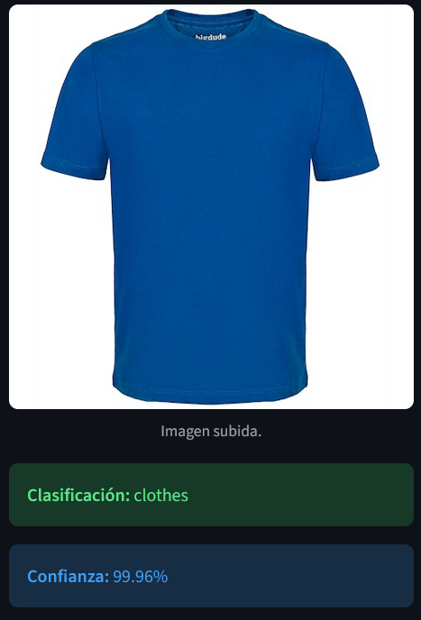
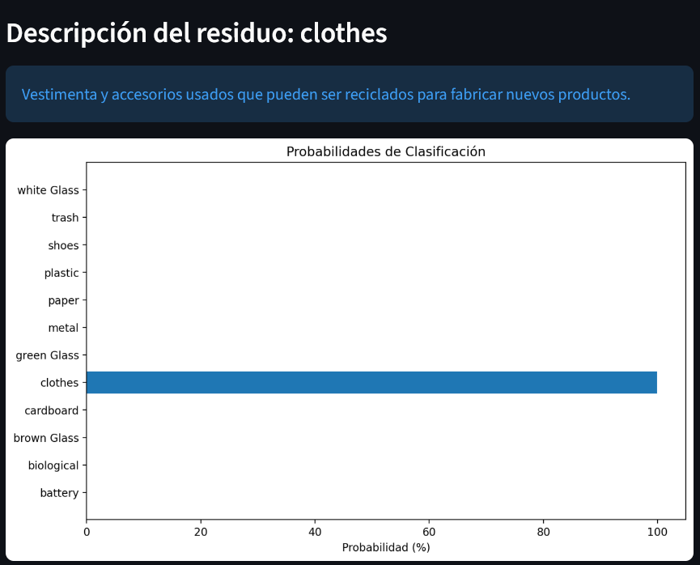
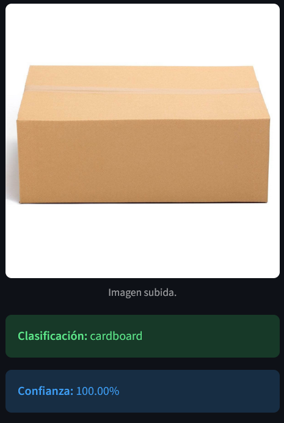
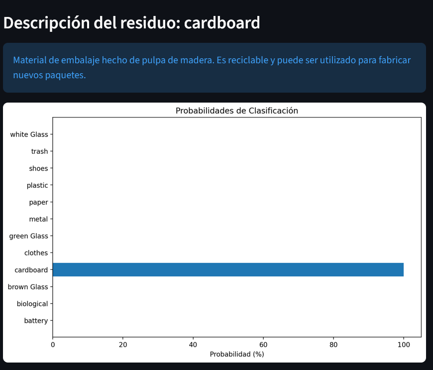
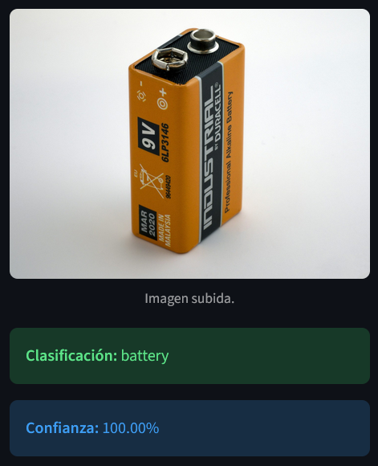
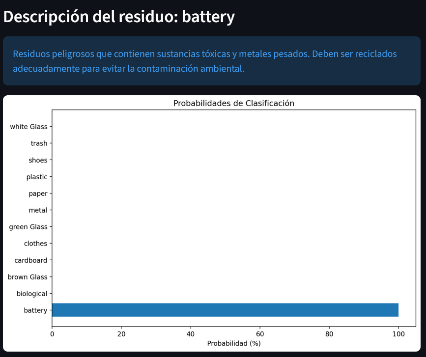

<!-- Improved compatibility of back to top link: See: https://github.com/othneildrew/Best-README-Template/pull/73 -->
<a id="readme-top"></a>

<h3 align="center">AI Trash Sorter 🤖</h3>

  <p align="center">
    A basic waste classifier built in Python using Convolutional Neural Networks (CNN).
  </p>
</div>

<!-- TABLE OF CONTENTS -->
<details>
  <summary>Table of Contents</summary>
  <ol>
    <li>
      <a href="#about-the-project">About The Project</a>
      <ul>
        <li><a href="#built-with">Built With</a></li>
      </ul>
    </li>
    <li>
      <a href="#getting-started">Getting Started</a>
      <ul>
        <li><a href="#prerequisites">Prerequisites</a></li>
        <li><a href="#installation">Installation</a></li>
      </ul>
    </li>
    <li><a href="#usage">Usage</a></li>
    <li><a href="#examples">Examples</a></li>
    <li><a href="#acknowledgments">Acknowledgments</a></li>
  </ol>
</details>

<!-- ABOUT THE PROJECT -->
## About The Project

Basic Trash Sorter (Waste Classifier) created in **Python** using AI, convolutional neural networks, and machine learning to self-train and classify different types of waste following the Kaggle dataset: [Garbage Classification](https://www.kaggle.com/datasets/mostafaabla/garbage-classification).

It supports 12 waste categories for efficient classification.

<p align="right">(<a href="#readme-top">back to top</a>)</p>

### Built With

* [![Python][Python-shield]][Python-url]
* [![TensorFlow][TensorFlow-shield]][TensorFlow-url]
* [![Streamlit][Streamlit-shield]][Streamlit-url]

<p align="right">(<a href="#readme-top">back to top</a>)</p>

<!-- GETTING STARTED -->
## Getting Started

To get a local copy up and running, follow these simple steps.

### Prerequisites

Ensure you have Python installed. Then, install the necessary dependencies:
* pip
  ```sh
  pip install -r requeriments.txt
  ```

### Installation

1. Clone the repo
   ```sh
   git clone https://github.com/jerichd4c/IA-trash-sorter.git
   ```
2. Install the necessary packages
   ```sh
   pip install -r requeriments.txt
   ```
3. Ensure the model `waste_classifier_model.h5` is in the root directory of the project.

<p align="right">(<a href="#readme-top">back to top</a>)</p>

<!-- USAGE EXAMPLES -->
## Usage

### Running the Application
To start the user interface with Streamlit:
```sh
streamlit run src/waste_app.py
```

### Training or Recompiling the Model
If you want to retrain the model:
```sh
python src/full_model.py
```
*Note: The process may take time depending on the hardware and dataset size.*

<p align="right">(<a href="#readme-top">back to top</a>)</p>

<!-- EXAMPLES -->
## Examples

<div align="center">

**Waste type: clothes**

*Statistics:*


**Waste type: cardboard**

*Statistics:*


**Waste type: battery**

*Statistics:*


</div>

<p align="right">(<a href="#readme-top">back to top</a>)</p>

<!-- MARKDOWN LINKS & IMAGES -->
[contributors-shield]: https://img.shields.io/github/contributors/jerichd4c/IA-trash-sorter.svg?style=for-the-badge
[contributors-url]: https://github.com/jerichd4c/IA-trash-sorter/graphs/contributors
[forks-shield]: https://img.shields.io/github/forks/jerichd4c/IA-trash-sorter.svg?style=for-the-badge
[forks-url]: https://github.com/jerichd4c/IA-trash-sorter/network/members
[stars-shield]: https://img.shields.io/github/stars/jerichd4c/IA-trash-sorter.svg?style=for-the-badge
[stars-url]: https://github.com/jerichd4c/IA-trash-sorter/stargazers
[issues-shield]: https://img.shields.io/github/issues/jerichd4c/IA-trash-sorter.svg?style=for-the-badge
[issues-url]: https://github.com/jerichd4c/IA-trash-sorter/issues
[license-shield]: https://img.shields.io/github/license/jerichd4c/IA-trash-sorter.svg?style=for-the-badge
[license-url]: https://github.com/jerichd4c/IA-trash-sorter/blob/main/LICENSE
[Python-shield]: https://img.shields.io/badge/Python-3776AB?style=for-the-badge&logo=python&logoColor=white
[Python-url]: https://www.python.org/
[TensorFlow-shield]: https://img.shields.io/badge/TensorFlow-FF6F00?style=for-the-badge&logo=tensorflow&logoColor=white
[TensorFlow-url]: https://www.tensorflow.org/
[Streamlit-shield]: https://img.shields.io/badge/Streamlit-FF4B4B?style=for-the-badge&logo=Streamlit&logoColor=white
[Streamlit-url]: https://streamlit.io/

<!-- ACKNOWLEDGMENTS -->
## Acknowledgments

* [Kaggle Garbage Classification Dataset](https://www.kaggle.com/datasets/mostafaabla/garbage-classification)
* [Streamlit Documentation](https://docs.streamlit.io/)
* [TensorFlow Guide](https://www.tensorflow.org/guide)

<p align="right">(<a href="#readme-top">back to top</a>)</p>